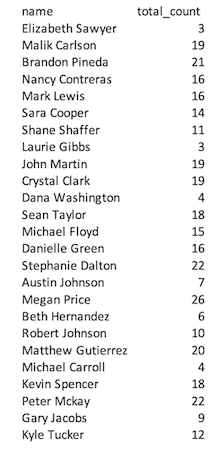
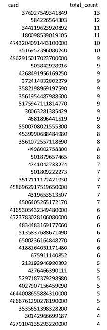
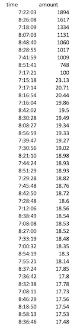
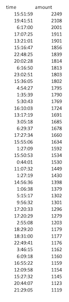
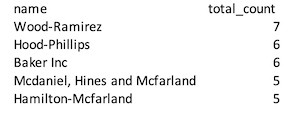

# Fraud_Challenge
Assignment #6, Module 7 Challenge Assignment

## Background for Assignment
Fraud is prevalent these days, whether you are a small taco shop or a large international business. While there are emerging technologies that employ machine learning and artificial intelligence to detect fraud, many instances of fraud detection still require strong data analytics to find abnormal charges.

## Instructions
Original Instructions included in the Instructions.md file

## Part 1:

### Some fraudsters hack a credit card by making several small transactions (generally less than $2.00), which are typically ignored by cardholders.

* How can you isolate (or group) the transactions of each cardholder?
    * You can group the transactions of each cardholder by linking the "Transaction", "Credit_Card" and "Cardholder" tables together.

* Count the Transactions that are less than $2.00 per cardholder
    * See the queries.sql file for details on how this data was obtained.  The results can also be seen in the "Transactions Under $2.00 by Cardholder" csv file.  The results are:

* Is there any evidence to suggest that a credit card has been hacked?
    * Given that this by by cardholder and not credit card, it's hard to determine if anything is going on.  As one cardholder may have more than one card, we cannot tell if higher numbers are due to a higher number of cards or a higher number of transacations. If we look at this data by credit card we may get a better idea.  
    * See the queries.sql file for details on how this data was obtained.  The results can also be seen in the "Transactions Under $2.00 by Card" csv file.  The top 42 results are:

    * Based on this, we may believe that some of the Credit Cards may have been hacked, however, there is no time information here, so it's still difficult to draw any conclusions.

### Take your investigation a step futher by considering the time period in which potentially fraudulent transactions are made. 

* What are the top 100 highest transactions made between 7:00 am and 9:00 am?
    * See the queries.sql file for details on how this data was obtained.  The full results can also be seen in the "Top_100_AM" csv file.  The top 42 results are: 

* Do you see any anomalous transactions that could be fraudulent?
    * There are some transactions that may be abnormally high.  The Top 7 are all over $1,000, the 8th and 9th are over $99 and then the rest are all under $25.  These may be odd transactions or they may be fraudulant, but there is nothing conclusive.

* Is there a higher number of fraudulent transactions made during this time frame versus the rest of the day?
    * Since we have not really been able to define what fraudulent transactions are, this question cannot be answered.  Looking at transactions during the rest of the day, there are still high and low transactions.  From this basic analysis, I would say that no definitive answers can be given.
    * I have also looked at the highest transactions during the rest of the day.  See the queries.sql file for details on how this data was obtained.  The full results can also be seen in the "Highest 100 Other Transactions" csv file.  The top 42 results are: 

* If you answered yes to the previous question, explain why you think there might be fraudulent transactions during this time frame.
    * My answer above is inconclusive, so there is no explaination available here.

* What are the top 5 merchants prone to being hacked using small transactions?
    * See the queries.sql file for details on how this data was obtained.  The full results can also be seen in the "Transactions Under $2.00 by Merchant" csv file.  The top 5 results are: 

    

